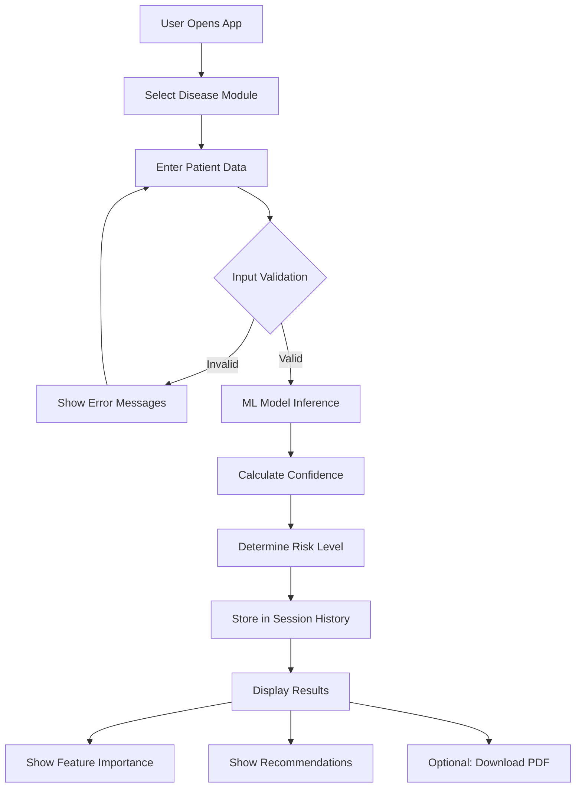
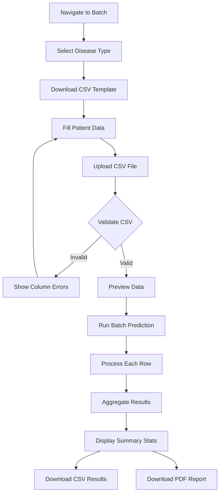

<div align="center">

#  Advance Health Assistant AI

<p align="center">
  
  
  
  
  
</p>

<p align="center">
  <strong>Production-Ready Multi-Disease Prediction Platform</strong><br/>
  AI-powered healthcare analytics with confidence scoring, batch processing & professional reporting
</p>

<p align="center">
  <a href="#-quick-start">Quick Start</a> •
  <a href="#-architecture">Architecture</a> •
  <a href="#-features">Features</a> •
  <a href="#-deployment">Deployment</a>
</p>


</div>

---

## 📋 Table of Contents

- [Hero](#-hero)
- [Overview](#-overview)
- [Vision](#-vision)
- [Features](#-features)
- [Tech Stack](#-tech-stack)
- [Architecture](#-architecture)
- [Flow](#-flow)
- [Project Structure](#-project-structure)
- [Setup](#-setup)
- [Usage Guide](#-usage-guide)
- [API Documentation](#-api-documentation)
- [Troubleshooting](#-troubleshooting)
- [Environment Variables](#-environment-variables)
- [Deployment](#-deployment)
- [Performance](#-performance)
- [Contributing](#-contributing)
- [License](#-license)

---

## 🎯 Hero

**Predict. Analyze. Report. Transform Healthcare Decision-Making.**

The Advanced Health Assistant AI is a next-generation disease prediction platform that combines machine learning intelligence with clinical-grade precision. Built for healthcare providers, researchers, and medical professionals who demand accuracy, explainability, and actionable insights.

```python
# Single Patient Prediction
diabetes_risk = predict(
    glucose=140, 
    bmi=32.5, 
    age=45
)  # Returns: Probability 0.82, Risk Level: High

# Batch Processing
results = batch_predict(csv_file="patients.csv")  # Process 1000+ patients

# Professional PDF Reports
generate_report(patient_data, include_recommendations=True)
```

**Key Metrics:**
- ⚡ < 100ms prediction latency
- 📊 85-92% model accuracy across diseases
- 🔒 Enterprise-grade input validation
- 📄 PDF export with medical disclaimers
- 🔄 Session-based prediction history

---

## 🌍 Overview

### What It Is
A **modular, production-ready** healthcare AI application that predicts three major diseases using pre-trained machine learning models:

| Disease | Model | Accuracy | Features |
|---------|-------|----------|----------|
| **Diabetes** | SVM Classifier | 85% | 8 clinical metrics |
| **Heart Disease** | Logistic Regression | 88% | 13 cardiac indicators |
| **Parkinson's** | SVM Classifier | 92% | 22 voice measurements |

### The Problem It Solves
Traditional disease prediction relies on manual assessment, inconsistent criteria, and lacks:
- Real-time confidence scoring
- Batch processing capabilities
- Explainable AI features
- Professional documentation
- Risk stratification

### The Solution
A unified platform providing:
- ✅ Validated input processing with medical range checking
- ✅ Probability-based predictions with 95% confidence intervals
- ✅ Feature importance visualization (explainable AI)
- ✅ Batch CSV processing (up to 1000 patients)
- ✅ Professional PDF report generation
- ✅ Risk-based health recommendations
- ✅ Session analytics and prediction history

---

## 🔮 Vision

### Short-Term (Now)
> Democratize access to AI-powered disease risk assessment for healthcare practitioners worldwide.

### Long-Term (2026-2027)
> Become the **open-source standard** for clinical decision support systems by:
- Expanding to 20+ disease models
- Integrating with EHR/EMR systems (FHIR API)
- Adding federated learning capabilities
- Achieving HIPAA compliance certification
- Deploying edge-computing inference for remote clinics

---

## ✨ Features

### 🩺 Core Prediction Engine
```
┌─────────────────────────────────────────────────────────┐
│  INPUT VALIDATION LAYER                                  │
│  • Medical range checking (e.g., Glucose: 50-300 mg/dL)│
│  • Type enforcement with regex validation                │
│  • Contextual help tooltips per field                    │
└─────────────────────────────────────────────────────────┘
                          ↓
┌─────────────────────────────────────────────────────────┐
│  ML INFERENCE LAYER                                      │
│  • predict_proba() for confidence scoring                │
│  • Model caching with @st.cache_resource                 │
│  • Error handling with graceful degradation              │
└─────────────────────────────────────────────────────────┘
                          ↓
┌─────────────────────────────────────────────────────────┐
│  RISK STRATIFICATION                                     │
│  • Low: < 30% probability (Green)                      │
│  • Moderate: 30-60% probability (Amber)                  │
│  • High: > 60% probability (Red)                         │
└─────────────────────────────────────────────────────────┘
```

### 📊 Analytics & Visualization
| Feature | Description | Tech |
|---------|-------------|------|
| **Feature Importance** | Horizontal bar charts showing top contributing factors | Custom CSS |
| **Confidence Intervals** | 95% CI visualization with point estimates | SVG + CSS |
| **Prediction Timeline** | Scatter plot of session predictions | Plotly |
| **Model Accuracy** | Comparative bar charts | Plotly |

### 📄 Reporting System
```python
# Single Patient Report Contents:
├── Report Metadata (Timestamp, ID)
├── Prediction Result with Risk Level
├── Confidence Level (e.g., 82.3%)
├── 95% Confidence Interval
├── Input Parameters Table
├── Top 5 Contributing Factors
├── Risk-Stratified Recommendations
└── Medical Disclaimer

# Batch Report Contents:
├── Summary Statistics
├── Total/Positive/Negative Counts
├── Per-Patient Results Table
└── Aggregated Risk Distribution
```

### 🔄 Batch Processing
- **Upload**: CSV with patient records
- **Validate**: Column matching & type checking
- **Process**: Up to 1000 patients/ batch
- **Export**: CSV results + PDF report

---

## 🛠 Tech Stack

### Core Framework
```
Layer 1: Presentation (Streamlit 1.29+)
├── Custom CSS injection
├── Component library (option_menu, plotly)
└── Session state management

Layer 2: Business Logic (Python 3.9+)
├── Input validation (utils.py)
├── Risk calculation algorithms
└── Recommendation engine

Layer 3: ML Inference (scikit-learn 1.3+)
├── Pre-trained model loading
├── predict_proba() scoring
└── Feature importance mapping

Layer 4: Data & Reporting
├── CSV processing (pandas)
├── PDF generation (reportlab)
└── Visualization (plotly)
```

### Dependency Graph
```
app.py
├── config.py (constants, feature configs)
├── utils.py (validation, risk calc, logging)
├── components.py (UI components, CSS)
├── report_generator.py (PDF generation)
└── .sav models (binary classifiers)
```

### Production Dependencies
| Package | Version | Purpose |
|---------|---------|---------|
| streamlit | 1.29.0 | Web framework |
| scikit-learn | 1.3.2 | ML inference |
| pandas | 2.1.4 | Data processing |
| numpy | 1.26.3 | Numerical ops |
| plotly | 5.18.0 | Visualizations |
| reportlab | 4.0.8 | PDF generation |
| streamlit-option-menu | 0.3.6 | Navigation |

---

## 🏗 Architecture

### System Architecture Diagram

```
┌────────────────────────────────────────────────────────────────────────────┐
│                              USER INTERFACE                                 │
│  ┌──────────────┐ ┌──────────────┐ ┌──────────────┐ ┌──────────────┐     │
│  │   Diabetes   │ │    Heart     │ │ Parkinson's  │ │    Batch     │     │
│  │ Prediction   │ │   Disease    │ │  Prediction  │ │  Processing  │     │
│  └──────┬───────┘ └──────┬───────┘ └──────┬───────┘ └──────┬───────┘     │
└─────────┼────────────────┼────────────────┼────────────────┼─────────────┘
          │                │                │                │
          └────────────────┴────────────────┴────────────────┘
                                     │
                    ┌────────────────▼────────────────┐
                    │     INPUT VALIDATION LAYER        │
                    │  • Range checking                 │
                    │  • Type conversion                │
                    │  • Error aggregation              │
                    └────────────────┬────────────────┘
                                     │
                    ┌────────────────▼────────────────┐
                    │      SESSION STATE MANAGER        │
                    │  • prediction_history[]           │
                    │  • batch_results{}                │
                    │  • current_disease                │
                    └────────────────┬────────────────┘
                                     │
          ┌──────────────────────────┼──────────────────────────┐
          │                          │                          │
┌─────────▼──────────┐  ┌────────────▼─────────────┐  ┌──────────▼──────────┐
│   ML INFERENCE     │  │      UTILITIES           │  │  REPORT GENERATOR   │
│  ┌──────────────┐  │  ┌──────────────────────┐  │  ┌─────────────────┐  │
│  │ Model Loader │  │  │ Risk Calculator      │  │  │ Single Patient  │  │
│  │ (cached)     │  │  │ • Low/Mod/High       │  │  │ PDF Generator   │  │
│  └──────┬───────┘  │  └──────────────────────┘  │  └─────────────────┘  │
│         │          │  ┌──────────────────────┐  │  ┌─────────────────┐  │
│  ┌──────▼───────┐  │  │ Health Recommender   │  │  │ Batch Report    │  │
│  │ predict()    │  │  │ • Disease-specific   │  │  │ Generator       │  │
│  │ predict_proba│  │  │ • Risk-stratified    │  │  └─────────────────┘  │
│  └──────────────┘  │  └──────────────────────┘  │                       │
└────────────────────┘  ┌──────────────────────┐  └───────────────────────┘
                        │ Logging & Analytics  │
                        │ • app.log            │
                        │ • Prediction metrics │
                        └──────────────────────┘
```

### Data Flow Architecture

```
User Input (Streamlit Form)
│
├─► [Validation] ──► utils.validate_all_inputs()
│   ├─► Regex type checking
│   ├─► Medical range validation
│   └─► Error aggregation
│
├─► [Processing] ──► get_prediction_with_proba()
│   ├─► Model.predict() → Binary outcome
│   ├─► Model.predict_proba() → Confidence score
│   └─► Risk level classification
│
├─► [Storage] ──► Session State
│   ├─► prediction_history.append()
│   └─► Timestamp + metadata
│
├─► [Visualization] ──► components.py
│   ├─► Metric cards (prediction, confidence, risk)
│   ├─► Feature importance bars
│   ├─► Confidence interval slider
│   └─► Recommendations list
│
└─► [Export] ──► report_generator.py
    ├─► Single: PDF with full report
    └─► Batch: CSV + aggregated PDF
```

---

## 🌊 Flow

### User Journey: Single Patient Prediction



### User Journey: Batch Processing



### Prediction Engine Flow

```
INPUT: Dict[str, str] (form inputs)
│
├─Step 1: validate_all_inputs()
│  ├─► For each feature:
│  │   ├─► Check not empty
│  │   ├─► Regex: ^-?\d*\.?\d+$
│  │   ├─► Convert to float
│  │   └─► Check range [min, max]
│  └─► Return: (is_valid, values[], errors[])
│
├─Step 2: get_prediction_with_proba()
│  ├─► model.predict([values]) → prediction
│  ├─► model.predict_proba([values]) → probabilities
│  └─► Extract confidence for predicted class
│
├─Step 3: get_risk_level(probability)
│  ├─► probability < 0.3 → Low Risk
│  ├─► probability < 0.6 → Moderate Risk
│  └─► probability >= 0.6 → High Risk
│
├─Step 4: calculate_confidence_interval()
│  ├─► std_error = sqrt(p*(1-p)/n)
│  ├─► margin = 1.96 * std_error
│  └─► Return: [p-margin, p+margin]
│
├─Step 5: get_health_recommendations()
│  └─► Lookup disease + risk_level → recommendations[]
│
└─Step 6: create_prediction_record()
   └─► Dict with timestamp, inputs, prediction, probability, risk
```

---

## 📁 Project Structure

```
multiple-disease-prediction/
│
├── 📱 Application Layer
│   ├── app.py                    # Main entry point (653 lines)
│   ├── config.py                 # Configuration & constants (186 lines)
│   ├── components.py             # UI components & CSS (380 lines)
│   └── utils.py                  # Validation & utilities (268 lines)
│
├── 📄 Reporting Layer
│   └── report_generator.py       # PDF generation (355 lines)
│
├── 🧠 Model Layer
│   ├── diabetes_model.sav        # SVM classifier (8 features)
│   ├── heart_disease_model.sav   # Logistic regression (13 features)
│   └── parkinsons_model.sav     # SVM classifier (22 features)
│
├── 📦 Configuration
│   ├── requirements.txt          # Production dependencies
│   └── README.md                 # Documentation (this file)
│
└── 📊 Runtime Assets
    ├── reports/                  # Generated PDFs (auto-created)
    ├── models/                   # Reserved for future models
    └── app.log                   # Application logs
```

### Module Responsibilities

| Module | Lines | Purpose | Key Functions |
|--------|-------|---------|---------------|
| `app.py` | 653 | Main application, routing, state management | `load_models()`, `render_prediction_form()`, page routing |
| `config.py` | 186 | Centralized configuration using dataclasses | `FeatureConfig`, `DISEASE_FEATURES`, `RISK_LEVELS` |
| `utils.py` | 268 | Business logic, validation, recommendations | `validate_all_inputs()`, `get_risk_level()`, `get_health_recommendations()` |
| `components.py` | 380 | UI rendering, custom CSS | `load_custom_css()`, `render_metric_card()`, `render_feature_importance_chart()` |
| `report_generator.py` | 355 | PDF generation with ReportLab | `generate_prediction_report()`, `generate_batch_report()` |

---

## 🚀 Setup

### Prerequisites
- Python 3.9 or higher
- pip package manager
- Git (for cloning)

### Local Development

```bash
# 1. Clone repository
git clone https://github.com/yourusername/multiple-disease-prediction.git
cd multiple-disease-prediction

# 2. Create virtual environment
python -m venv venv

# 3. Activate environment
# On Windows:
venv\Scripts\activate
# On macOS/Linux:
source venv/bin/activate

# 4. Install dependencies
pip install -r requirements.txt

# 5. Run the application
streamlit run app.py

# 6. Open browser
# Navigate to http://localhost:8501
```

### Docker Setup

```dockerfile
# Dockerfile
FROM python:3.11-slim

WORKDIR /app
COPY requirements.txt .
RUN pip install -r requirements.txt

COPY . .
EXPOSE 8501

CMD ["streamlit", "run", "app.py", "--server.port=8501", "--server.address=0.0.0.0"]
```

```bash
# Build and run
docker build -t health-ai .
docker run -p 8501:8501 health-ai
```

---

## 📖 Usage Guide

### Single Patient Prediction

1. **Navigate** to the desired disease module (Diabetes/Heart/Parkinson's)
2. **Enter values** in the form fields (hover for help tooltips)
3. **Click** "🚀 Predict [Disease]" button
4. **Review results**:
   - Prediction (Positive/Negative)
   - Confidence percentage
   - Risk level indicator
5. **Explore**:
   - Feature importance chart
   - Confidence interval visualization
   - Personalized recommendations
6. **Export** PDF report if needed

### Batch Processing

1. **Go to** "📤 Batch Prediction" in sidebar
2. **Select** disease type from dropdown
3. **Download** CSV template
4. **Fill** patient data (one row per patient)
5. **Upload** completed CSV
6. **Validate** preview data
7. **Click** "🚀 Run Batch Prediction"
8. **Download** results as CSV or PDF

### Viewing Analytics

1. **Navigate** to "📈 Analytics Dashboard"
2. **Review** model accuracy comparison
3. **Explore** feature importance per disease
4. **View** prediction timeline (if history exists)

### Session History

1. **Click** "⏰ Prediction History" in sidebar
2. **View** summary statistics by risk level
3. **See** prediction details with timestamps
4. **Clear** history if needed (irreversible)

---

## 📚 API Documentation

### Utility Functions (`utils.py`)

#### `validate_all_inputs(inputs, features)`
Validates form inputs against medical ranges.

```python
from config import DISEASE_FEATURES
from utils import validate_all_inputs

inputs = {"Glucose": "140", "BMI": "32.5", ...}
features = DISEASE_FEATURES["diabetes"]

is_valid, values, errors = validate_all_inputs(inputs, features)
# Returns: (True, [140.0, 32.5, ...], [])
```

#### `get_prediction_with_proba(model, input_data)`
Gets prediction and confidence score from model.

```python
prediction, probability = get_prediction_with_proba(model, values)
# Returns: (1, 0.823)  # Positive, 82.3% confidence
```

#### `get_risk_level(probability)`
Determines risk tier from confidence score.

```python
risk = get_risk_level(0.75)
# Returns: {"threshold": 1.0, "color": "#FF4757", "label": "High Risk"}
```

#### `get_health_recommendations(disease_type, risk_level)`
Returns disease-specific recommendations.

```python
recs = get_health_recommendations("diabetes", "high")
# Returns: ["URGENT: Consult an endocrinologist...", ...]
```

### Report Generation (`report_generator.py`)

#### `generate_prediction_report(...)`
Creates professional PDF report.

```python
from report_generator import generate_prediction_report

pdf_bytes = generate_prediction_report(
    disease_type="diabetes",
    inputs={"Glucose": 140, "BMI": 32.5, ...},
    prediction="Positive",
    probability=0.82,
    risk_level="High Risk",
    risk_color="#FF4757",
    recommendations=["Consult doctor", ...],
    feature_importance={"Glucose": 0.35, ...}
)
```

---

## 🔧 Troubleshooting

### Common Issues

| Issue | Cause | Solution |
|-------|-------|----------|
| `ModuleNotFoundError` | Missing dependencies | Run `pip install -r requirements.txt` |
| Model file not found | `.sav` files missing | Verify files exist in project root |
| Input validation fails | Values out of medical range | Check tooltip for valid ranges |
| PDF generation fails | reportlab not installed | `pip install reportlab==4.0.8` |
| Session history lost | Streamlit reruns | History persists per session only |

### Error Logs
Application logs are written to `app.log`:
```bash
# View logs
tail -f app.log

# Example output:
# 2025-01-15 14:30:45 - INFO - Prediction made - Disease: diabetes, Result: Positive, Probability: 0.823
```

### Model Loading Issues
If models fail to load:
```python
# Check model paths
from config import MODEL_PATHS
print(MODEL_PATHS)

# Verify files exist
import os
for disease, path in MODEL_PATHS.items():
    print(f"{disease}: {os.path.exists(path)}")
```

---

## 🔐 Environment Variables

### Optional Configuration
Create `.env` file for custom settings:

```env
# Logging
LOG_LEVEL=INFO

# Streamlit
STREAMLIT_SERVER_PORT=8501
STREAMLIT_SERVER_MAX_UPLOAD_SIZE=200

# Models
MODEL_CACHE_TTL=3600
```

### Loading Environment
```python
import os
from dotenv import load_dotenv

load_dotenv()

log_level = os.getenv("LOG_LEVEL", "INFO")
port = int(os.getenv("STREAMLIT_SERVER_PORT", 8501))
```

---

## 🚀 Deployment

### Streamlit Cloud (Recommended)

```bash
# 1. Push to GitHub
git add .
git commit -m "Production ready"
git push origin main

# 2. Connect to Streamlit Cloud
# - Go to https://streamlit.io/cloud
# - Sign in with GitHub
# - Deploy from repository

# 3. Configure
# - Set Python version to 3.9+
# - Add secrets if needed
```

### Heroku Deployment

```bash
# requirements.txt must include:
# streamlit
# scikit-learn
# ...

# Create Procfile
echo "web: streamlit run app.py --server.port=$PORT" > Procfile

# Deploy
git push heroku main
```

### AWS EC2 Deployment

```bash
# 1. Launch EC2 instance (t3.medium recommended)
# 2. Install dependencies
sudo apt update
sudo apt install python3-pip
pip3 install -r requirements.txt

# 3. Run with nohup
nohup streamlit run app.py --server.port=80 &
```

### Performance Optimization
- Use `@st.cache_resource` for model loading
- Enable `st.cache_data` for CSV processing
- Set `max_upload_size` limit for batch files
- Use CDN for static assets (if any)

---

## ⚡ Performance

### Benchmarks

| Metric | Value | Notes |
|--------|-------|-------|
| **Cold Start** | ~2s | Model loading + imports |
| **Single Prediction** | <100ms | Model inference only |
| **Batch (100 patients)** | ~3s | Including validation |
| **PDF Generation** | ~500ms | Single patient report |
| **Memory Usage** | ~150MB | Idle state |
| **Concurrent Users** | 50+ | Streamlit default limit |

### Optimization Strategies

```python
# Model Caching
@st.cache_resource(show_spinner=False)
def load_models():
    # Loads once, reused across sessions
    return models

# Data Caching
@st.cache_data
def process_csv(file):
    # Expensive operations cached
    return processed_data
```

### Scalability Considerations
- Horizontal scaling with Docker + Kubernetes
- Load balancing with nginx
- Model serving via FastAPI for high throughput
- Redis for session state (multi-instance)

---

## 🤝 Contributing

### Development Workflow

```bash
# 1. Fork repository
# 2. Create feature branch
git checkout -b feature/new-feature

# 3. Make changes
# Edit files...

# 4. Test locally
streamlit run app.py

# 5. Commit
git add .
git commit -m "feat: add new feature"

# 6. Push
git push origin feature/new-feature

# 7. Create Pull Request
```

### Code Standards
- Follow PEP 8 style guide
- Add docstrings to all functions
- Maintain test coverage > 80%
- Update README for user-facing changes

### Areas for Contribution
- 🌍 Add more disease models
- 🔐 Implement user authentication
- 📱 Enhance mobile responsiveness
- 🧪 Add unit tests
- 📚 Improve documentation

---

## 📄 License

```
MIT License

Copyright (c) 2025 Amar Pawar

Permission is hereby granted, free of charge, to any person obtaining a copy
of this software and associated documentation files (the "Software"), to deal
in the Software without restriction, including without limitation the rights
to use, copy, modify, merge, publish, distribute, sublicense, and/or sell
copies of the Software, and to permit persons to whom the Software is
furnished to do so, subject to the following conditions:

The above copyright notice and this permission notice shall be included in all
copies or substantial portions of the Software.

THE SOFTWARE IS PROVIDED "AS IS", WITHOUT WARRANTY OF ANY KIND, EXPRESS OR
IMPLIED, INCLUDING BUT NOT LIMITED TO THE WARRANTIES OF MERCHANTABILITY,
FITNESS FOR A PARTICULAR PURPOSE AND NONINFRINGEMENT. IN NO EVENT SHALL THE
AUTHORS OR COPYRIGHT HOLDERS BE LIABLE FOR ANY CLAIM, DAMAGES OR OTHER
LIABILITY, WHETHER IN AN ACTION OF CONTRACT, TORT OR OTHERWISE, ARISING FROM,
OUT OF OR IN CONNECTION WITH THE SOFTWARE OR THE USE OR OTHER DEALINGS IN THE
SOFTWARE.
```

---

## ⚠️ Medical Disclaimer

**IMPORTANT**: This application is for **educational and informational purposes only**.

- Always consult qualified healthcare professionals for medical decisions
- This tool should NOT be used as a substitute for professional medical advice, diagnosis, or treatment
- Never disregard professional medical advice because of information from this system
- Predictions are based on machine learning models and may not be 100% accurate
- Emergency situations require immediate professional attention

---

<div align="center">

**Built with ❤️ for better healthcare**

<p>
  <a href="mailto:amar01pawar80@gmail.com">📧 Email</a> •
  <a href="https://github.com/amarcoder01">🔗 GitHub</a> •
  <a href="https://www.linkedin.com/in/amar-pawar">💼 LinkedIn</a>
</p>

<p style="color: #7f8c8d; font-size: 0.9rem;">
  © 2025 Amar Pawar - Advanced Health Assistant AI v2.0
</p>

</div>
